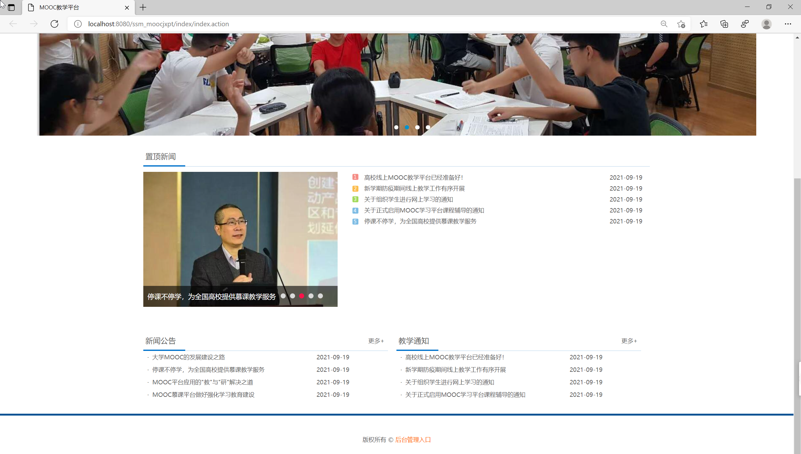
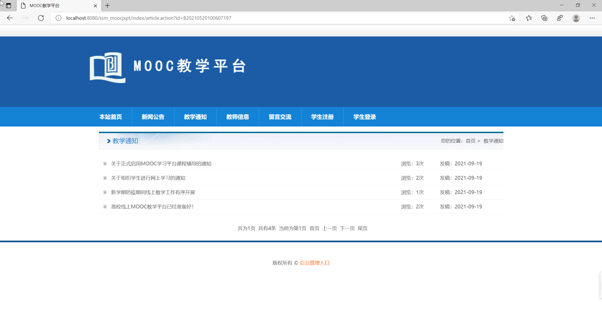
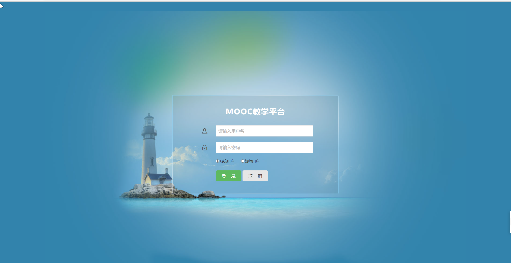
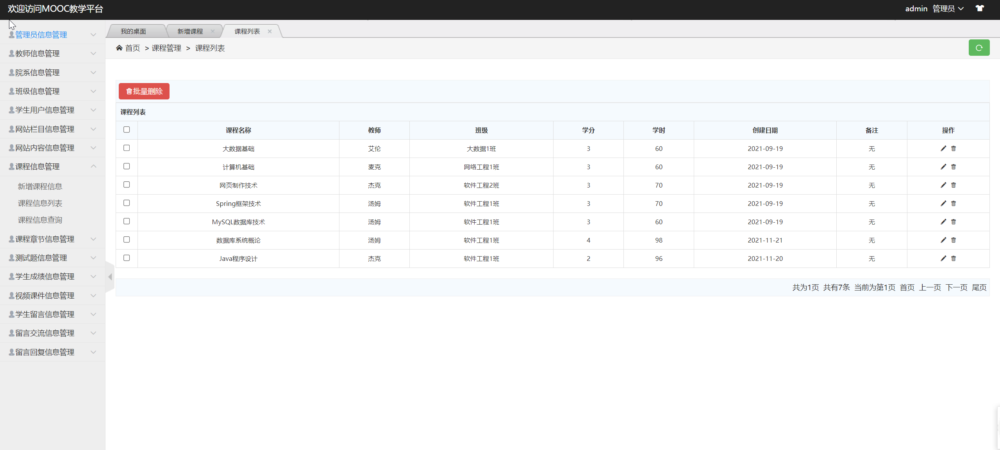

基于SSM的MOOC教学平台
=
### 完整代码获取地址：从戎源码网 ([https://armycodes.com/](https://armycodes.com/))
### 作者微信：19941326836  QQ：952045282 
### 承接计算机毕业设计、Java毕业设计、Python毕业设计、深度学习、机器学习
### 选题+开题报告+任务书+程序定制+安装调试+论文+答辩ppt 一条龙服务
### 所有选题地址https://github.com/nature924/allProject

一、项目介绍
---
基于SSM框架的MOOC教学平台、网络教学平台，该系统主要分为前台和后台两大功能模块，共包含三种角色，分别是：学生、教师、系统管理员。
### 
1.前台功能
前台首页、新闻公告、教学通知、教师信息、留言交流、学生注册、学生登陆、个人中心、我的课程、我的成绩、在线测试、我的错题集、教学视频等功能。

### 
2.后台功能
后台系统登陆、学生信息管理、教师信息管理、管理员信息管理、院系信息管理、班级信息管理、课程信息管理、课程章节管理、网站公告管理、测试题管理、学生成绩管理、视频课件管理、学生留言管理、留言交流管理等功能。

二、项目技术
---
- 编程语言：Java
- 数据库：MySQL
- 项目管理工具：Maven
- 前端技术：JSP、HTML、Jquery、Layui、ECharts
- 后端技术：Spring、SpringMVC、MyBatis

三、运行环境
---
- 操作系统：Windows、macOS都可以
- JDK版本：JDK1.8以上都可以
- 开发工具：IDEA、Ecplise、Myecplise都可以
- 数据库: MySQL5.7以上都可以
- Tomcat：任意版本都可以
- Maven：任意版本都可以

四、运行截图
---

### 程序截图：

